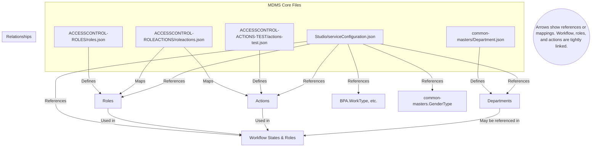

# MDMS (Master Data Management Service) in the `dj` Folder

## What is MDMS?

MDMS (Master Data Management Service) is a core service in the DIGIT platform that manages master data and configuration for various modules. It provides APIs to define schemas, create, update, and search master data, and ensures that all configuration and reference data is centrally managed and accessible to all services.

- [MDMS Overview](https://core.digit.org/platform/core-services/mdms-v2-master-data-management-service/mdms-master-data-management-service)
- [Configuring Master Data](https://core.digit.org/platform/core-services/mdms-v2-master-data-management-service/mdms-master-data-management-service/setting-up-master-data/configuring-master-data)
- [Adding New Master](https://core.digit.org/platform/core-services/mdms-v2-master-data-management-service/mdms-master-data-management-service/setting-up-master-data/adding-new-master)

## How does MDMS work?

- **Schema Definition:** Each type of master data (e.g., departments, roles, actions) has a schema that defines its structure and validation rules.
- **Data Storage:** Master data is stored in a database (PostgreSQL in MDMS v2), but for local version control, it is also maintained as JSON files in the repository.
- **APIs:** MDMS exposes APIs to create, update, and search both schemas and data. Data can be loaded from these files into the service or fetched via API.

## The `dj` Folder Structure

The `data/dj` folder contains all the configuration and master data for the `dj` tenant. Each subfolder represents a module or domain (e.g., `common-masters`, `ACCESSCONTROL-ROLEACTIONS`, `PropertyTax`, etc.). Inside each subfolder, you will find JSON files that define master data for that module.

### Example: `common-masters/Department.json`

```json
{
  "tenantId": "dj",
  "moduleName": "common-masters",
  "Department": [
    { "name": "Administration", "code": "ADM", "active": true },
    { "name": "Tax", "code": "REV", "active": true }
    // ... more departments ...
  ]
}
```

- This file defines the list of departments available for the `dj` tenant.

### Example: `ACCESSCONTROL-ROLEACTIONS/roleactions.json`

```json
{
  "tenantId": "dj",
  "moduleName": "ACCESSCONTROL-ROLEACTIONS",
  "roleactions": [
    { "rolecode": "EMPLOYEE", "actionid": 1, "tenantId": "dj" },
    { "rolecode": "EMPLOYEE", "actionid": 1650, "tenantId": "dj" }
    // ... more role-action mappings ...
  ]
}
```

- This file defines which actions are mapped to which roles for access control.

## How is this data used?

- **Local Playground:** The JSON files in the `dj` folder act as a playground for configuring and testing master data before pushing it to the MDMS service/database via API.
- **Source of Truth:** These files are version-controlled, making it easy to track changes and collaborate.
- **Deployment:** Data from these files can be loaded into the MDMS service using APIs, making the configurations live for the tenant.

## Summary

- The `dj` folder is the local representation of all master data and configuration for the `dj` tenant, structured by module.
- Each JSON file corresponds to a master data set or configuration, following the schema expected by MDMS.
- For more details, refer to the [official MDMS documentation](https://core.digit.org/platform/core-services/mdms-v2-master-data-management-service/mdms-master-data-management-service).

## Mind Map: How Key MDMS Files Are Linked

Below is a mind map showing how the most recently changed files in the `dj` folder are related to each other:



### Explanation of Relationships

- **Department.json**: Defines the list of departments, which may be referenced in workflows or service configurations.
- **roles.json**: Defines all available roles (e.g., CITIZEN, EMPLOYEE, BPA roles).
- **roleactions.json**: Maps roles to actions, establishing what each role can do.
- **actions-test.json**: Defines actions (API endpoints, permissions) that can be mapped to roles.
- **serviceConfiguration.json**: References roles, actions, departments, and other master data to define workflows, permissions, and service logic for modules like BPA.
- **Workflow**: The workflow logic in serviceConfiguration.json uses roles and actions to define who can perform what at each state.

This mind map and explanation should help you quickly understand how the most relevant MDMS files interact and depend on each other in the `dj` folder.

## Module Linkage Table

Below is a table of all modules in the `dj` folder, tagged as `linked` or `isolated` based on whether they are referenced by or reference other modules. Click on file paths to view the files directly:

| Module (Folder)            | File(s) (Path)                                                                                                                                  | Tag      | Notes on Linkage                                                                               |
| -------------------------- | ----------------------------------------------------------------------------------------------------------------------------------------------- | -------- | ---------------------------------------------------------------------------------------------- |
| Studio                     | [Studio/serviceConfiguration.json](../data/dj/Studio/serviceConfiguration.json)                                                                 | linked   | References roles, actions, departments, and other master data for workflows and service logic. |
| ACCESSCONTROL-ROLES        | [ACCESSCONTROL-ROLES/roles.json](../data/dj/ACCESSCONTROL-ROLES/roles.json)                                                                     | linked   | Roles are mapped to actions and referenced in workflows and permissions.                       |
| ACCESSCONTROL-ROLEACTIONS  | [ACCESSCONTROL-ROLEACTIONS/roleactions.json](../data/dj/ACCESSCONTROL-ROLEACTIONS/roleactions.json)                                             | linked   | Maps roles to actions; core to access control.                                                 |
| ACCESSCONTROL-ACTIONS-TEST | [ACCESSCONTROL-ACTIONS-TEST/actions-test.json](../data/dj/ACCESSCONTROL-ACTIONS-TEST/actions-test.json)                                         | linked   | Defines actions, which are mapped to roles and referenced in workflows.                        |
| common-masters             | [common-masters/Department.json](../data/dj/common-masters/Department.json), [GenderType.json](../data/dj/common-masters/GenderType.json), etc. | linked   | Departments, gender types, etc., are referenced in forms, workflows, and service configs.      |
| BPA                        | [BPA/WorkType.json](../data/dj/BPA/WorkType.json), [IdentityType.json](../data/dj/BPA/IdentityType.json), etc.                                  | linked   | WorkType and other masters are referenced in Studio/serviceConfiguration.json.                 |
| Workflow                   | [Workflow/BusinessService.json](../data/dj/Workflow/BusinessService.json), etc.                                                                 | linked   | Workflow definitions reference roles and actions.                                              |
| tenant                     | [tenant/tenants.json](../data/dj/tenant/tenants.json), [citymodule.json](../data/dj/tenant/citymodule.json), etc.                               | linked   | Tenants and city modules are referenced in service configs and workflows.                      |
| ws-services-masters        | [ws-services-masters/](../data/dj/ws-services-masters/)                                                                                         | isolated | No direct references found in core linked modules above.                                       |
| ws-services-calculation    | [ws-services-calculation/](../data/dj/ws-services-calculation/)                                                                                 | isolated | No direct references found in core linked modules above.                                       |
| sw-services-calculation    | [sw-services-calculation/](../data/dj/sw-services-calculation/)                                                                                 | isolated | No direct references found in core linked modules above.                                       |
| firenoc                    | [firenoc/](../data/dj/firenoc/)                                                                                                                 | isolated | No direct references found in core linked modules above.                                       |
| inbox-dss                  | [inbox-dss/](../data/dj/inbox-dss/)                                                                                                             | isolated | No direct references found in core linked modules above.                                       |
| inbox-v2                   | [inbox-v2/](../data/dj/inbox-v2/)                                                                                                               | isolated | No direct references found in core linked modules above.                                       |
| mCollect                   | [mCollect/](../data/dj/mCollect/)                                                                                                               | isolated | No direct references found in core linked modules above.                                       |
| mseva                      | [mseva/](../data/dj/mseva/)                                                                                                                     | isolated | No direct references found in core linked modules above.                                       |
| egf-master                 | [egf-master/](../data/dj/egf-master/)                                                                                                           | isolated | No direct references found in core linked modules above.                                       |
| egov-hrms                  | [egov-hrms/](../data/dj/egov-hrms/)                                                                                                             | isolated | No direct references found in core linked modules above.                                       |
| djibouti                   | [djibouti/](../data/dj/djibouti/)                                                                                                               | isolated | No direct references found in core linked modules above.                                       |
| dss-dashboard              | [dss-dashboard/](../data/dj/dss-dashboard/)                                                                                                     | isolated | No direct references found in core linked modules above.                                       |
| Vehicle                    | [Vehicle/](../data/dj/Vehicle/)                                                                                                                 | isolated | No direct references found in core linked modules above.                                       |
| Vendor                     | [Vendor/](../data/dj/Vendor/)                                                                                                                   | isolated | No direct references found in core linked modules above.                                       |
| WaterCharges               | [WaterCharges/](../data/dj/WaterCharges/)                                                                                                       | isolated | No direct references found in core linked modules above.                                       |
| TradeLicense               | [TradeLicense/](../data/dj/TradeLicense/)                                                                                                       | isolated | No direct references found in core linked modules above.                                       |
| PropertyTax                | [PropertyTax/](../data/dj/PropertyTax/)                                                                                                         | isolated | No direct references found in core linked modules above.                                       |
| RAINMAKER-PGR              | [RAINMAKER-PGR/](../data/dj/RAINMAKER-PGR/)                                                                                                     | isolated | No direct references found in core linked modules above.                                       |
| StakeholderRegistraition   | [StakeholderRegistraition/](../data/dj/StakeholderRegistraition/)                                                                               | isolated | No direct references found in core linked modules above.                                       |
| FSM                        | [FSM/](../data/dj/FSM/)                                                                                                                         | isolated | No direct references found in core linked modules above.                                       |
| FinanceService             | [FinanceService/](../data/dj/FinanceService/)                                                                                                   | isolated | No direct references found in core linked modules above.                                       |
| NOC                        | [NOC/](../data/dj/NOC/)                                                                                                                         | isolated | No direct references found in core linked modules above.                                       |
| DocumentUploader           | [DocumentUploader/](../data/dj/DocumentUploader/)                                                                                               | isolated | No direct references found in core linked modules above.                                       |
| EDCR                       | [EDCR/](../data/dj/EDCR/)                                                                                                                       | isolated | No direct references found in core linked modules above.                                       |
| DIGIT-UI                   | [DIGIT-UI/](../data/dj/DIGIT-UI/)                                                                                                               | isolated | No direct references found in core linked modules above.                                       |
| DataSecurity               | [DataSecurity/](../data/dj/DataSecurity/)                                                                                                       | isolated | No direct references found in core linked modules above.                                       |
| DigitStudio                | [DigitStudio/](../data/dj/DigitStudio/)                                                                                                         | isolated | No direct references found in core linked modules above.                                       |
| BillingService             | [BillingService/](../data/dj/BillingService/)                                                                                                   | isolated | No direct references found in core linked modules above.                                       |
| Channel                    | [Channel/](../data/dj/Channel/)                                                                                                                 | isolated | No direct references found in core linked modules above.                                       |
| Chatbot                    | [Chatbot/](../data/dj/Chatbot/)                                                                                                                 | isolated | No direct references found in core linked modules above.                                       |
| CitizenEngagement          | [CitizenEngagement/](../data/dj/CitizenEngagement/)                                                                                             | isolated | No direct references found in core linked modules above.                                       |
| BillAmendment              | [BillAmendment/](../data/dj/BillAmendment/)                                                                                                     | isolated | No direct references found in core linked modules above.                                       |

**Legend:**

- **linked**: Module is referenced by or references other modules (e.g., via roles, actions, workflows, or service configs).
- **isolated**: Module appears to be standalone, with no direct references to or from the core linked modules.

## BPA Module: File Overview (Updated Linkage)

Below is an updated table listing all files in the `BPA` module, with clickable links, a brief description, and a linkage tag. The linkage was determined by searching for references to each file across the codebase.

| File (Path)                                                               | Tag      | Description                                                            |
| ------------------------------------------------------------------------- | -------- | ---------------------------------------------------------------------- |
| [ApplicationType.json](../data/dj/BPA/ApplicationType.json)               | isolated | Defines types of BPA applications.                                     |
| [BPAApplicationMapping.json](../data/dj/BPA/BPAApplicationMapping.json)   | isolated | Maps BPA application types to other config.                            |
| [BuildingPermitConfig.json](../data/dj/BPA/BuildingPermitConfig.json)     | isolated | Configuration for building permits.                                    |
| [CalculationType.json](../data/dj/BPA/CalculationType.json)               | isolated | Types of calculations for BPA.                                         |
| [CheckList.json](../data/dj/BPA/CheckList.json)                           | isolated | Checklist items for BPA processes.                                     |
| [DocTypeMapping.json](../data/dj/BPA/DocTypeMapping.json)                 | isolated | Maps document types for BPA.                                           |
| [EdcrConfig.json](../data/dj/BPA/EdcrConfig.json)                         | isolated | Configuration for EDCR integration.                                    |
| [HomePageUrlLinks.json](../data/dj/BPA/homePageUrlLinks.json)             | isolated | Links for BPA home page.                                               |
| [IdentityType.json](../data/dj/BPA/IdentityType.json)                     | isolated | Defines identity types for BPA applications.                           |
| [InspectionReportConfig.json](../data/dj/BPA/InspectionReportConfig.json) | isolated | Config for inspection reports.                                         |
| [NocTypeMapping.json](../data/dj/BPA/NocTypeMapping.json)                 | isolated | NOC type mapping for BPA.                                              |
| [OCBuildingPermitConfig.json](../data/dj/BPA/OCBuildingPermitConfig.json) | isolated | Config for OC building permits.                                        |
| [OCEdcrConfig.json](../data/dj/BPA/OCEdcrConfig.json)                     | isolated | Config for OC EDCR.                                                    |
| [OccupancyType.json](../data/dj/BPA/OccupancyType.json)                   | isolated | Types of occupancy for BPA.                                            |
| [ProposedLandUse.json](../data/dj/BPA/ProposedLandUse.json)               | isolated | Proposed land use types.                                               |
| [RiskTypeComputation.json](../data/dj/BPA/RiskTypeComputation.json)       | isolated | Logic/config for risk type computation.                                |
| [ServiceType.json](../data/dj/BPA/ServiceType.json)                       | isolated | Lists service types available in BPA.                                  |
| [StakeholderConfig.json](../data/dj/BPA/StakeholderConfig.json)           | isolated | Config for BPA stakeholders.                                           |
| [SubOccupancyType.json](../data/dj/BPA/SubOccupancyType.json)             | isolated | Sub-types of occupancy.                                                |
| [TownPlanningScheme.json](../data/dj/BPA/TownPlanningScheme.json)         | isolated | Town planning scheme data.                                             |
| [Usages.json](../data/dj/BPA/Usages.json)                                 | isolated | Usage types for BPA.                                                   |
| [WorkType.json](../data/dj/BPA/WorkType.json)                             | linked   | Work types for BPA; referenced in service configuration and workflows. |

**Note:** The "linked" tag means the file is referenced by other modules or core configuration (e.g., `WorkType.json` is referenced in workflow/service configuration). "Isolated" means no references were found elsewhere in the codebase for that file.
